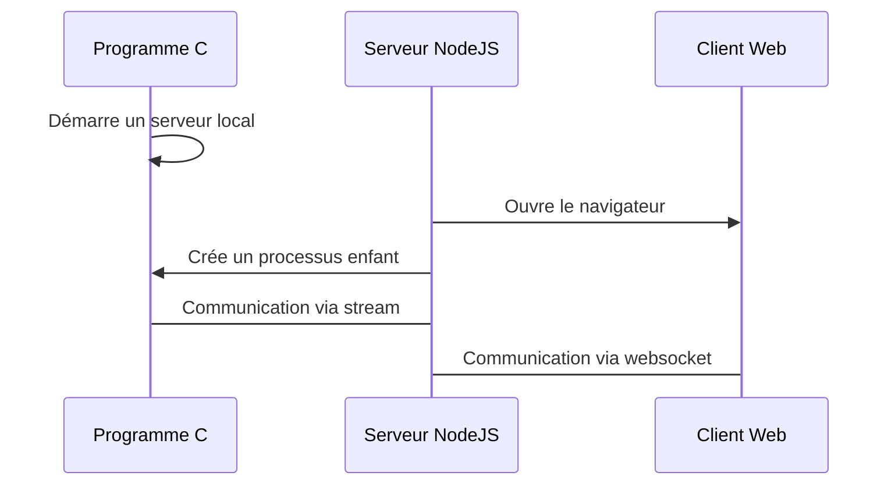
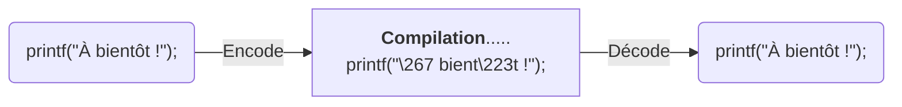

# Agenda Développé par Thomas de Lachaux et Louis Bichet      
      
[Télécharger l'executable](https://github.com/HerelAdrastel/NF05/releases/tag/v1.0)
      
 # Mode d'emploi  
  
3 executables sont disponibles à la racine du projet:   
- *Agenda.exe*: Programme par défaut. Affiche correctement les accents des consoles récentes de Windows comme Powershell ou Cmder.  
- *Agenda-encode.exe*: Exactement le même programme que ci-dessus, mais les accents sont compatibles l'affichage sur le cmd.exe de Windows.  
- *GUI.exe*: Interface graphique  
  
Pour les autres plateformes. Vous sûr compiler le projet depuis les sources.  
  
 # Structure du projet      
 Le projet est divisé en plusieurs sous dossiers:      
- *src/*: Les source du programme principal      
- *utils/*: Des plugins que nous avons développé pour faciliter le développement de l'application.      
   - *Accents/* Encode et décode les fichiers sources en ASCII Etendu en base octale      
   - *Doxystyle/*: Modernise le visuel de la documentation      
      
    
      
# Outils accessoires crées  
  
## Interface utilisateur  
Une interface utilisateur est disponible pour augmenter l'ergonomie du programme. Voici un schéma expliquant le fonctionnement de l'interface graphique.  
  

Le serveur NodeJS joue le rôle de messager entre le programme et le client Web. Le programme est executé avec des arguments différents qu'un lancement sous console pour avoir une sortie formatée en HTML. La sortie est récupérée par NodeJS qui l'envoie au client web via des sockets.  
  
Le chemin est effectué dans le sens inverse quand un bouton est cliqué sur le client Web, ou qu'un texte est entré.  
  
### Executer depuis les sources  
  
**Prérequis**: Avoir NodeJS installé  
  
Commandes pour installer les outils nécessaires:  
```  
npm install -g yarn pkg nodemon  
yarn  
```  
  
Pour executer l'interface : `yarn start`  
Pour executer l'interface en live-reload: `yarn dev`  
Pour compiler l'interface pour Windows: `yarn builddev`  
Pour compiler l'interface pour Windows, Mac et Linux: `yarn build`  
  
  
## Accents      
### Problématique Par défaut, sur Windows, les consoles sont encodés avec la page de code 850. Cela correspond à la table ASCII Etendue.     
Pour verifier la page de code sur votre console, taper `chcp`.    
    
Le code source est encodé en UTF-8 (chcp 65001). Par défaut, sur MacOS et Linux, les consoles sont encodées en UTF-8.    
Dans ce cas là, on aura un affichage correct.    
    
Mais sur Windows, le code `printf("À bientôt !");` affichera`├Ç bient├┤t !`.      
      
On peut résoudre ce problème en exécutant l'instruction suivante: `printf("\267 bient\223t !");` `\267` correspond au caractère `À` dans la table ASCII étendu en base octale. De même pour `\223` qui correspond au `ô`.       
      
Cependant, cette phrase n'est pas très lisible et peut gêner lors du développement de l'application.      
      
### Résolution Pour résoudre ce problème nous avons développé un script en Python. Cet algorithme, en agira en fonction du premier argument donné:      
- Si le premier argument est `encode`, le script convertie tous les caractères spéciaux dans les fichiers sources en caractères octaux de la base ASCII.      
- Si le premier argument est `decode`, le script convertie tous les caractères octaux de la base ASCII dans les fichiers sources en caractères spéciaux.      
      
Ainsi, quand nous lançons la compilation, l'ordinateur exécute d'abord le script en mode d'encodage, puis compile le programme, puis exécute le script de décodage.      
      
    
    

    
 ### Exécuter le script   
 Le script est situé dans le dossier *utils/accents*. Il est disponible au format `.py` et `.exe`.      
      
Tout d'abord, il vous faut ouvrir un terminal **et de bien vérifier que le dossier courant du terminal soit celui du script**, des exceptions seront levés dans le cas contraire.      
      
### Exécuter le script à partir de l'exécutable **Prérequis**: avoir un système d'exploitation Windows.      
- Pour encoder les fichiers sources, tapez `accents.exe encode` - Pour décoder les fichiers sources, tapez `accents.exe decode`      
 ### Exécuter le script à partir des sources   
 **Prérequis**: [Python 3.x](https://www.python.org) (Testé avec Python 3.7)      
- Pour encoder les fichiers sources, tapez `python accents.py encode` - Pour décoder les fichiers sources, tapez `python accents.py decode`      
 ### Convertir le `.py` en `.exe`   
 **Prérequis**: [Python 3.x](https://www.python.org) (Testé avec Python 3.7)      
Il vous faudra aussi [PyInstaller](https://www.pyinstaller.org) installable via la commande `pip install pyinstaller`.      
      
Entrez ensuite `pyinstaller accents.spec`      
 ## Doxystyle   
 ### Problématique   
 En utilisant Doxygen, nous avons constaté que le design du site est assez vieux.       
      
### Résolution Cependant nous avons pu résoudre ce problème car Doxygen nous offre la possibilité de modifier les entêtes HTML ainsi que d'ajouter des fichiers supplémentaires comme des feuilles de styles, des scripts ou des images.      
      
Le développement est principalement basé sur le fichier `styles.less`. Pour nous aider dans la modification du design, nous somme inspiré de celui proposé par [Bootstrap](https://getbootstrap.com).    
      
Nous avons modifiés les propriétés de nombreuses classes du code. A chaque modification, il fallait suffixer la ligne par `!important` pour être sûr que notre propriété soit prioritaire par rapport à celle par défaut. Au lieu de le faire manuellement, nous avons utilisé le language [LESS](http://lesscss.org). La commande [lessc](https://www.npmjs.com/package/less) compile `styles.less` vers `styles.css`.     
      
Quand il était impossible de styliser ou sélectionner un élément avec des règles précises en CSS, nous avons utilisé du javascript avec le framework jQuery (déjà inclus par Doxygen). Par exemple, pour ajouter des graphiques dans le README.md rapidement, nous avons utilisé [mermaid](https://mermaidjs.github.io). Il a fallu utiliser jQuery pour modifier le DOM et implémenter correctement cette bibliothèque.    
    
### Compiler le LESS en CSS    
 **Prérequis**: [Node.js](https://nodejs.org)    
Installer less via la commande `npm install -g less`.    
Pour compiler `styles.less`, ouvrez un terminal, placez-vous le dossier Doxystyle et entrez `lessc styles.less styles.css`.    
      
## Compiler le projet à partir des sources Le code principal est développé en C99. Pour le compiler, il vous faudra télécharger CMake ainsi qu'un compilateur C.      
  
## Outils externes utilisés  
- Interface graphique  
   - [NodeJS](https://nodejs.org)  Pour lancer un serveur en JavaScript
   - [ExpressJS](https://expressjs.com)  Pour gerer facilement les requêtes/réponses du serveur
   - [Yarn](https://yarnpkg.com)  Pour gérer plus facilement les dépendances que NPM
   - [socket.io](https://socket.io)  Pour communiquer avec le client web
   - [opn](https://github.com/sindresorhus/opn)  Pour lancer le navigateur par défaut
   - [nodemon](https://nodemon.io)  Pour live-reload le code serveur
   - [pkg](https://github.com/zeit/pkg)  Pour portabiliser le code sur Windows, Mac et Linux
   - [Bootstrap](https://getbootstrap.com)  Pour ne pas s'embêter avec la stylisation de l'interface
   - [jQuery](https://jquery.com)  Pour faire des dernières retouches du texte facilement
- Accents  
   - [Python 3.7](https://www.python.org)  Pour coder un petit script utilitaire rapidement
   - [PyInstaller](https://www.pyinstaller.org)  Pour portabiliser le code sur Windows
- Doxystyle  
   - [LESS](http://lesscss.org)  Pour éviter la redondance du CSS
   
  
    